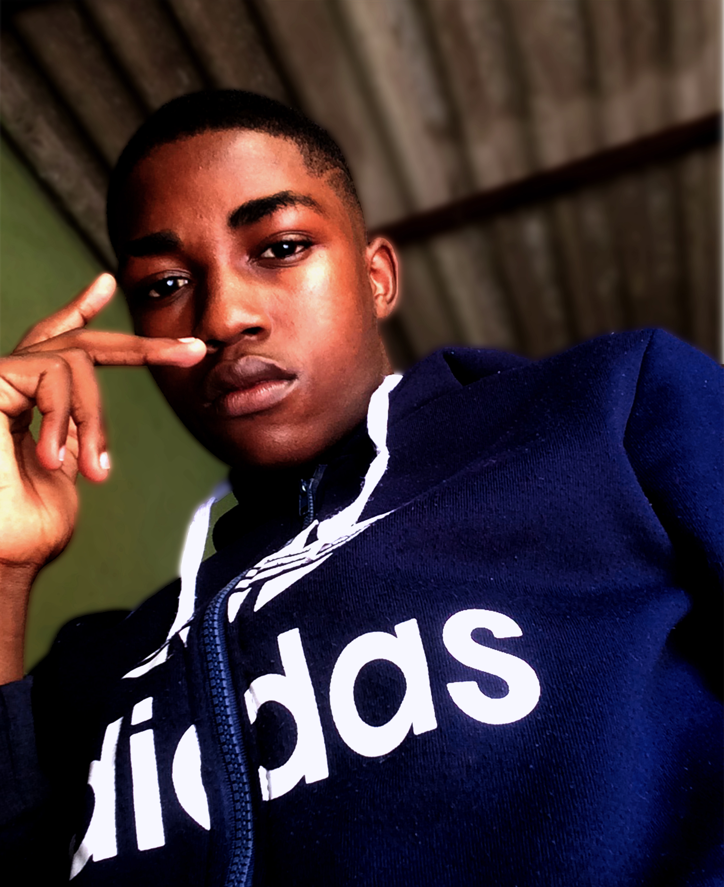

# One-Page 100% com Bootstrap

## Sobre o Projecto
É uma *One-Page 100% feita com **Bootstrap 4*** que criei para exercitar e testar as funcionalidades que foram implementadas nessa versão na época do seu lançamento.

***

***

***

## Tecnologias Utilizadas
- Html
- Css
- Bootstrap
- Animate.css

### Implantação do Projecto
- O projecto está hospedado na **Vercel**: https://bootstrap4-one-page.vercel.app/

### Autor
***

<figure>
    
    <figcaption>Edito Tchokoso</figcaption>
</figure>

Feito com ❤ por **Edito Tchokoso**, 👋🏽 Entre em contacto.
